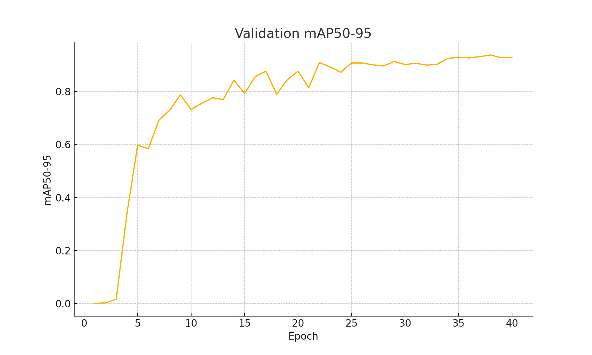
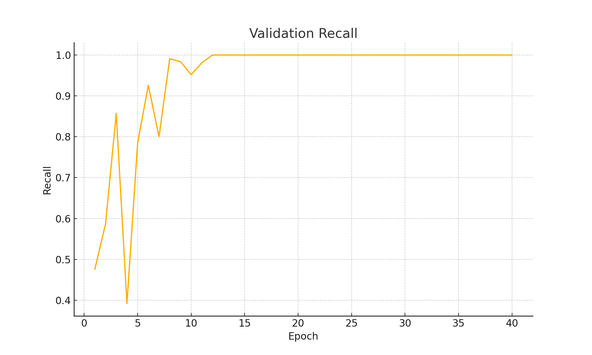
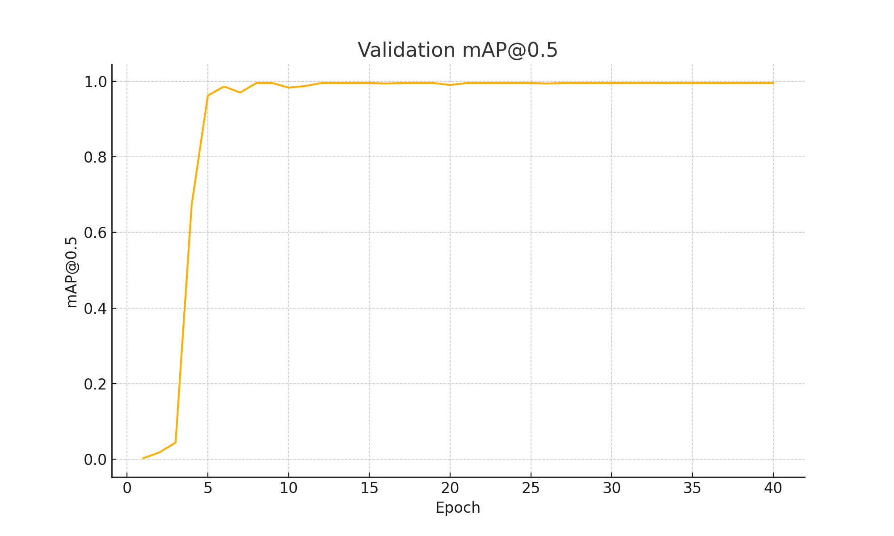
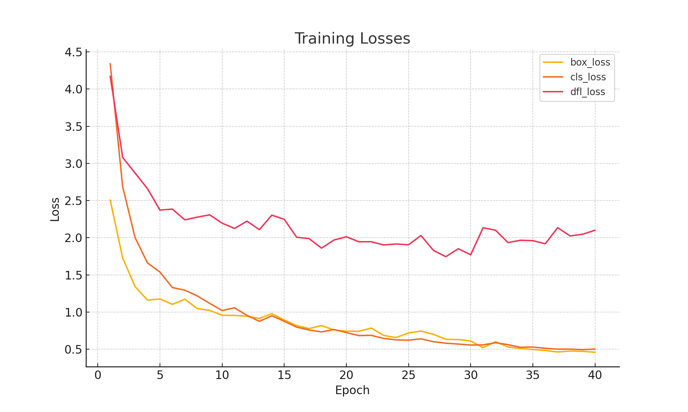
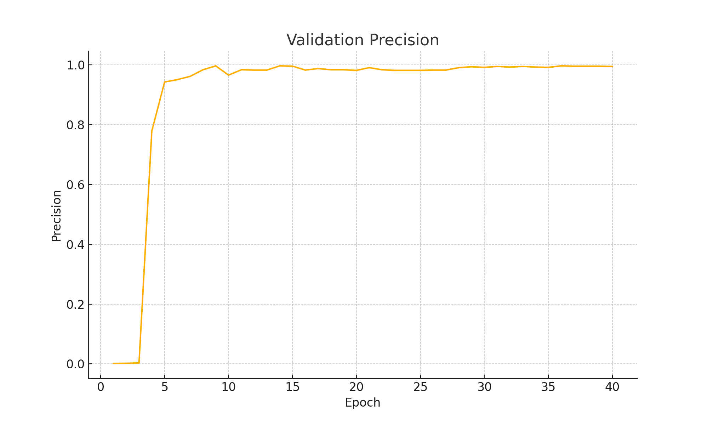
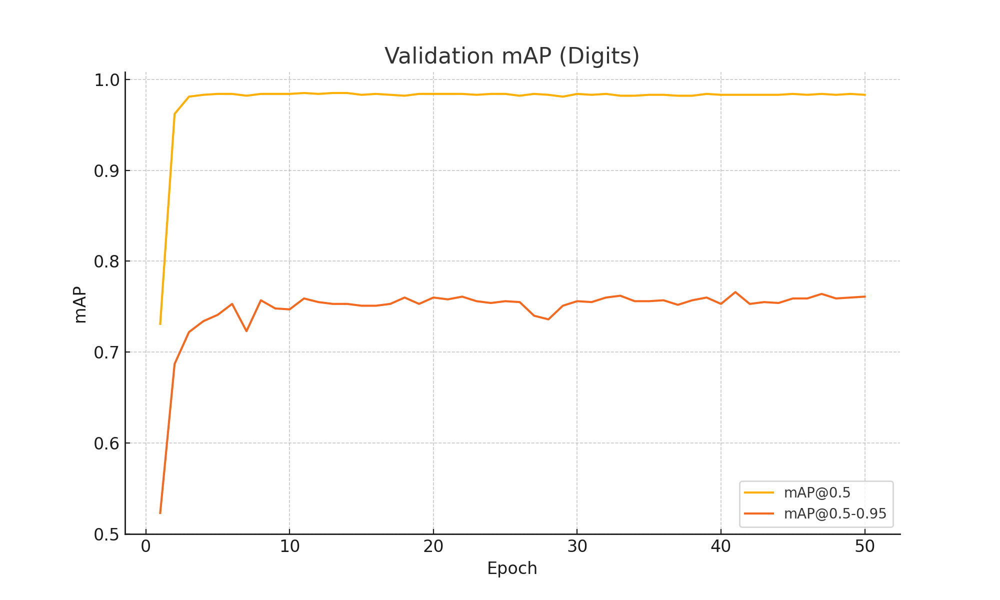
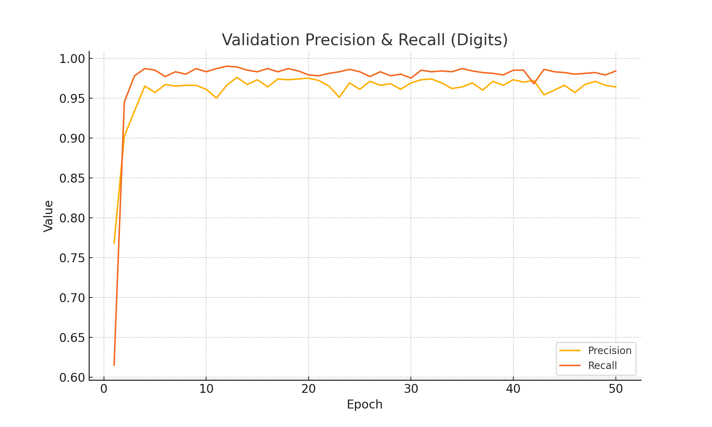
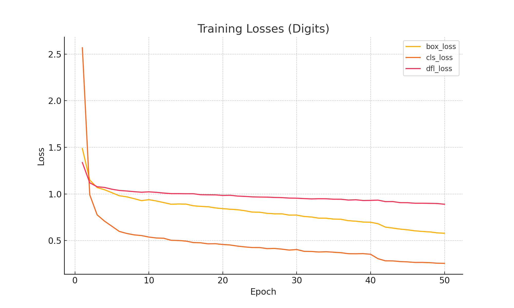

## 📖 Introduction

A deep-learning pipeline for **brain tumor segmentation** on the BraTS dataset. We segment three tumor sub-regions:

* **Whole Tumor (WT)**
* **Tumor Core (TC)**
* **Enhancing Tumor (ET)**

Modalities used: T1, T1Gd T2, FLAIR.
---

## 🏗️ Architecture


We employ a 3D U-Net (UNet3D) architecture for volumetric brain tumor segmentation. This model processes the full 3D MRI volumes directly, preserving spatial context across slices. Key components:

1. **Encoder**: Four 3D convolutional downsampling blocks (Conv3D → ReLU → MaxPool3D)
2. **Bottleneck**: Dilated 3D convolution layers for capturing multi-scale context
3. **Decoder**: Four 3D upsampling blocks with skip-connections to recover spatial resolution
4. **Attention Gates**: Integrated on skip paths to refine feature selection and suppress irrelevant activations

---

## 🛠️ Setup & Installation

**Prerequisites**

```bash
python >=3.8,<3.11
pip install -r requirements.txt
```

**Data**

Download BraTS 2020 dataset from \[[kaggle website](https://www.kaggle.com/datasets/awsaf49/brats20-dataset-training-validation)].

---

## 📊 Predicted & Real images

<table>
  <tr>
    <td></td>
    <td></td>
  </tr>
  <tr>
    <td></td>
    <td></td>
  </tr>
</table>

---

## 📊 Benchmarks & Metrics for plate ditection

<table>
  <tr>
    <td colspan="3" align="center"></td>
  </tr>
  <tr>
    <td></td>
    <td></td>
  </tr>
  <tr>
    <td></td>
    <td></td>
  </tr>
</table>

---

## 📊 Benchmarks & Metrics for digits ditection

<table>
  <tr>
    <td colspan="3" align="center"></td>
  </tr>
  <tr>
    <td></td>
    <td></td>
  </tr>
</table>

---

## 📝 License
- **Code License**: This repository’s **code** is released under the MIT License.
- **Dataset License**: MRI scans and annotations were downloaded from Kaggle and are subject to Kaggle’s dataset license terms. 

---

## 🤝 Contributing & Contact
Feel free to reach out by opening an issue or pull request. For direct questions, you may also contact:
* **Author**: Matin Gharehdaghi matingd.work@gmail.com
* **Acknowledgements**: Thanks to the MICCAI BraTS organizers and the research community.

Feel free to open issues or PRs for improvements!
